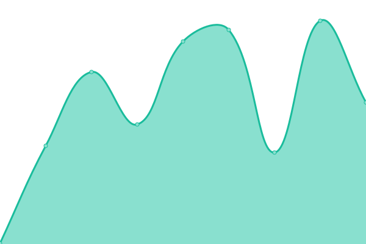

# [📈 Live Status](https://status.dy1.io): <!--live status--> **🟩 All systems operational**

This repository contains the open-source uptime monitor and status page for [Dylan](https://dy1.io), powered by [Upptime](https://github.com/upptime/upptime).

With [Upptime](https://upptime.js.org), you can get your own unlimited and free uptime monitor and status page, powered entirely by a GitHub repository. We use [Issues](https://github.com/dy1io/status.dy1.io/issues) as incident reports, [Actions](https://github.com/dy1io/status.dy1.io/actions) as uptime monitors, and [Pages](https://status.dy1.io) for the status page.

<!--start: status pages-->
<!-- This summary is generated by Upptime (https://github.com/upptime/upptime) -->
<!-- Do not edit this manually, your changes will be overwritten -->
<!-- prettier-ignore -->
| URL | Status | History | Response Time | Uptime |
| --- | ------ | ------- | ------------- | ------ |
|  Homelab | 🟩 Up | [homelab.yml](https://github.com/dy1io/status.dy1.io/commits/HEAD/history/homelab.yml) | 

 60ms
     
 | 

<a href="https://status.dy1.io/history/homelab">100.00%</a>
    

|  Rancher | 🟩 Up | [rancher.yml](https://github.com/dy1io/status.dy1.io/commits/HEAD/history/rancher.yml) | 

 371ms
     
 | 

<a href="https://status.dy1.io/history/rancher">100.00%</a>
    

|  Home Assistant | 🟩 Up | [home-assistant.yml](https://github.com/dy1io/status.dy1.io/commits/HEAD/history/home-assistant.yml) | 

 1658ms
     
 | 

<a href="https://status.dy1.io/history/home-assistant">100.00%</a>
    

|  [SISH](sish.dy1.io) | 🟩 Up | [sish.yml](https://github.com/dy1io/status.dy1.io/commits/HEAD/history/sish.yml) | 

 58ms
     
 | 

<a href="https://status.dy1.io/history/sish">100.00%</a>
    

|  Host a Thing | 🟩 Up | [host-a-thing.yml](https://github.com/dy1io/status.dy1.io/commits/HEAD/history/host-a-thing.yml) | 

 861ms
     
 | 

<a href="https://status.dy1.io/history/host-a-thing">100.00%</a>
    

<!--end: status pages-->

[**Visit our status website →**](https://status.dy1.io)

## 📄 License

- Powered by: [Upptime](https://github.com/upptime/upptime)
- Code: [MIT](./LICENSE) © [Dylan](https://dy1.io)
- Data in the `./history` directory: [Open Database License](https://opendatacommons.org/licenses/odbl/1-0/)
